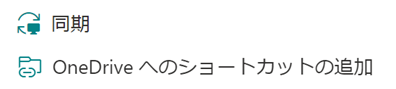

# GetThisWorkbookLocalPath
# OneDriveでThisWorkbook.PathがURLを返す問題を解決する 
[README(en).md](https://github.com/Excel-VBA-Diary/GetThisWorkbookLocalPath/blob/main/README(en).md) for English version  
初回投稿日：2023年12月11日  
最終更新日：2024年2月16日  
  
## 1. 解決したい問題  
  
OneDrive上でExcel VBAを動かすとThisWorkbook.PathがURLを返す問題が起きます。このままでは自分自身のローカルパスを取得できず、Dir関数やFileSystemObjectまで使えなくなるという不便な状態になります。  
  
この問題の解決にはいくつかの方法が提案されています。個人用OneDriveならば文字列変換で対応可能ですが、SharePointのファイルをOneDrive for Businessを経由して操作する場合、URLパスを文字列処理だけでローカルパスに変換する方法はうまくいきません。URLに含まれるテナントコードをテナント名に変換するなどの処理が必要で、文字列処理による方法では解決できません。  
    
SharePointやTeamsのファイルをOneDrive for Businessで利用するには「同期」と「OneDriveへのショートカットの追加」の二つの方法があります。  
  
「同期」は建物アイコンの下に、「OneDriveへのショートカットの追加」は雲アイコンの下に対象となるフォルダーがぶら下がります。それぞれローカルドライブ上のパスが異なりますが、どちらの方法でSharePointやTeamsのファイルにアクセスしているのかURLパスから知ることはできません。  
    
  
このような理由からOneDrive for Businessにおいて、ThisWorkbook.Pathが返すURLを文字列処理によってローカルパスに変換する方法には事実上無理があります。

## 2. 提案する解決策  
  
### GetLocalPath関数を使う  
  
URLパスをローカルパスに変換するGetLocalPath関数の解説とソースコードは下記のリポジトリにありますので、詳しくはそちらを参照してください。    
  [GetLocalPath](https://github.com/Excel-VBA-Diary/GetLocalPath)   
  
この解決策はWindowsのレジストリにあるOneDriveのマウント情報を使います。このマウント情報は次のサブキー配下にあります。  
```
\HKEY_CURRENT_USER\Software\SyncEngines\Providers\OneDrive
```
さらにローカルにあるOneDrive設定情報を取得してマウント情報を補完します。
```
C:\Users\<USER-NAME>\AppData\Local\Microsoft\OneDrive\Settings  
```
この関数を使ってThisWorkbook.Pathが返すURLパスをローカルパスに変換するには、次のような使い方になります。  
```
Dim localPath As String
localPath = GetLocalPath(ThisWorkbook.Path)
```  
### GetLocalPath関数以外の方法    

ここでは異なる以下の3つの方法を提案しています。いずれの方法も"ThisWorkbook.Path"を置き換えるためのもので、GetLocalPath関数のように汎用的にURLパスをローカルパスに変換するものではありません。  
\(1) 「最近開いた項目の表示」を利用する  
\(2) 開いているエクスプローラーを利用する  
\(3) SendKeysを利用する  
  
\(1)～\(3)のソースコードはこのリポジトリに掲載しています。標準モジュールをエクスポートしたファイルをそのまま掲載していますので、インポートするか、必要な部分をコピペしてお使いください。  
Module1.bas　「最近開いた項目の表示」を利用する方法  
Module2.bas　開いているエクスプローラーを利用する方法  
Module3.bas　SendKeysを利用する方法  

#### \(1) 「最近開いた項目の表示」を利用する    
  
ソースコードはModule1.basです。ローカルパスを取得する関数は GetThisWorkbookLocalPath1() です。

このコードは「最近開いた項目の表示」を利用するもので、最近開いたファイルやフォルダーが
  
    C:\Users\<user-name>\AppData\Roaming\Microsoft\Windows\Recent  
  
のフォルダーにリンクファイル（LNKファイル）として自動的に記録される機能を利用しています。このリンクファイルのリンク先を取得することでローカルドライブ上のパスを得ることができます。 
  
「最近開いた項目の表示」を利用するためには、Windowsの設定で「個人用設定」→「スタート」で「最近開いた項目の表示」をオンにします。

Windows 11 の場合は「最近開いた項目をスタート、ジャンプ リスト、ファイル エクスプローラーに表示する」

Windows 10 の場合は、「スタート メニューまたはタスク バーの、ジャンプ リストとエクスプローラーのクイック アクセスに最近開いた項目を表示する」

となっています。この設定がオフの場合は、上述のリンクファイル（LNKファイル）が記録されないため、GetThisWorkbookLocalPath1() は空文字（長さゼロの文字列）を返します。
  
既にローカルパスを取得済みであれば、取得済みの値を返すようにしています。ただし前回取得から30秒を超えた場合は再度リンクファイルのリンク先を取得します。    
  
#### 補足：レジストリキーの読み出し   
  
GetThisWorkbookLocalPath1() を呼び出す前に「最近開いた項目の表示」をオンになっているかどうかを知るにはレジストリキーを読んで調べます。そのための関数がIs_Start_TrackDocs() です。  
  
この関数は次のレジストリキーにある Start_TrackDocs の値を読んで、オン(1)ならTrue、オフ(0)ならFalseを返します。   
```
HKEY_CURRENT_USER\SOFTWARE\Microsoft\Windows\CurrentVersion\Explorer\Advanced\  
```
Is_Start_TrackDocs() 関数はGetThisWorkbookLocalPath1()の中では呼び出していませんので、必要に応じて使ってください。  

#### \(2) 開いているエクスプローラーを利用する    
  
ソースコードはModule2.basです。ローカルパスを取得する関数は GetThisWorkbookLocalPath2() です。

このコードは現在開いているExcelファイル（つまりThisWorkbook）が置かれているフォルダーを表示しているエクスプローラーからローカルパスを取得します。

具体的には、エクスプローラーのウインドウからのWindowオブジェクトを取得しLocationURLプロパティで"file:///C:/Users/～/～/OneDrive～/～"という絶対パス（URI）を取得します。

この絶対パス（URI）はエンコードされているのでデコードします。DecodeURL_ASCII()関数はそのためのものです。この関数でデコードされるのは特定のASCII文字だけです。  

フルセット版のDecodeURL関数も参考に記述しました。こちらはExcelのワークシート関数であるENCODEURL関数の逆関数になります。将来フルエンコードされた場合を想定して準備しています。  
  
GetThisWorkbookLocalPath2() は DecodeURL_ASCII() を使っていますが、DecodeURL() に変えてもよいでしょう。 
  
このようにGetThisWorkbookLocalPath2() は開いているエクスプローラーから情報を得ていますので、そのエクスプローラーを閉じてしまうと情報が得られなくなります。この場合、GetThisWorkbookLocalPath2() は空文字（長さゼロの文字列）を返します。

なお、OneDrive、OneDrive for Businessの直下（ルートフォルダー）に置かれている場合、ThisWorkbook.Pathはそれぞれ特定のURLパターンを返すので、エクスプローラーから情報を得ずとも、OneDriveにはEnviron("OneDrive")、OneDrive for BusinessにはEnviron("OneDriveCommercial")のローカルパスを対応させています。

既にローカルパスを取得済みであれば、取得済みの値を返すようにしています。ただし前回取得から30秒を超えた場合は再度、エクスプローラーからローカルパスを取得します。  
  
この解決策はThisWorkbookが置かれているフォルダーがエクスプローラで表示されていることが条件になります。したがって、そのエクスプローラーが閉じられている場合はGetThisWorkbookLocalPath2() は空文字（長さゼロの文字列）を返します。  
  
#### \(3) SendKeysを利用する     
  
ソースコードはModule3.basです。ローカルパスを取得する関数は GetThisWorkbookLocalPath3() です。

このコードは現在開いているExcelファイル（つまりThisWorkbook）自身にSendKeysによってキーストロークを送ってローカルパスを取得します。

OneDrive上に置かれたExcelファイルは「ファイル(F)」タブ→「情報(I)」→「ローカルパスのコピー(L)」でローカルパスをクリップボードに取得できます。

キーストロークは「Alt」→「F」→「I」→「L」となります。このあと元のホームタブに戻るため「Alt」→「H」→「↑」→「Enter」を送信します。

したがって実際のキーストロークは「Alt」→「F」→「I」→「L」→「Alt」→「H」→「↑」→「Enter」となります。

SendKeysはVBAのApplication.SendKeysメソッドは使えません。自分自身のリボンタブの操作にApplication.SendKeysメソッドはうまく機能しないためです。

この問題はPowerShellによって外部からExcelにキーストロークを送ることで解決できます。PowerShellで実行するキーストロークを送るスクリプトはコードの中に埋め込んでいます。

実は元のホームタブに戻るために「Esc」キーを送信したいところですが、タイミングによってはVBAが中断される場合があり、「Esc」キーの送信は避けています。

キーストロークの送信タイミングはスクリプトの中のStart-Sleepコマンドレットで指定しています。余裕のあるタイミングにしていますが、WindowsやOffice環境によってはStart-Sleepのタイミングを調整する必要があるかもしません。

キーストロークの送信によってウインドウが切り替わりますが正常な動作ですのでご承知おきください。キーストロークの送信に失敗した場合、GetThisWorkbookLocalPath3() は空文字（長さゼロの文字列）を返します。

前回取得から30秒以内であれば、キーストロークの送信は行わず、取得済みの値を返すようにしています。これによってウインドウの切り替わりは起きません。前回取得から30秒を超えた場合は再度キーストロークを送信します。  

この解決策はPowerShellを使っていますので、お使いのPC環境によってはセキュリティ保護が働きPowerShellを起動できない場合があります。  
  
## 3. 最後に 

SharePointやTeamsのドキュメントライブラリーのフォルダーを「同期」や「OneDriveへのショートカットの追加」によって、OneDrive for Businessを経由することでローカルドライブとして利用できます。これはWebアクセスを意識せずに利用できるメリットがあります。  
一方でこれらの新しい仕組みに対してVBAは非力です。今回の提案はそれを補う一つの方法ですが、そもそもVBAは2012年を最後に大きなアップデートはなくMicrosoftが提案する新しいソリューションに対して置き去りにされた感は否めません。  
  
ThisWorkbook.PathがURLを返す問題は解決されたとしても、SharePointを「同期」や「OneDriveへのショートカットの追加」でファイルを利用するケースでは組織の関係者が共有しているという関係から、CheckOut／CheckInといった排他制御が必要になる場合があります。  
  
もちろんVBAにはCheckOut／CheckInのメッソドがありますが、リトライ処理を含むフロー制御が必要になり単純ではありません。
その意味から今回の提案は、他に解決方法がない場合の暫定的な手段と捉えるべきでしょう。

## 4. ライセンス 

このコードはMITライセンスに基づき利用できます。 

■    
